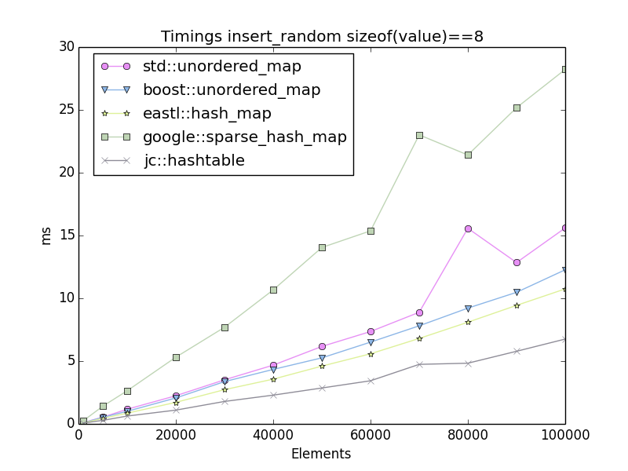
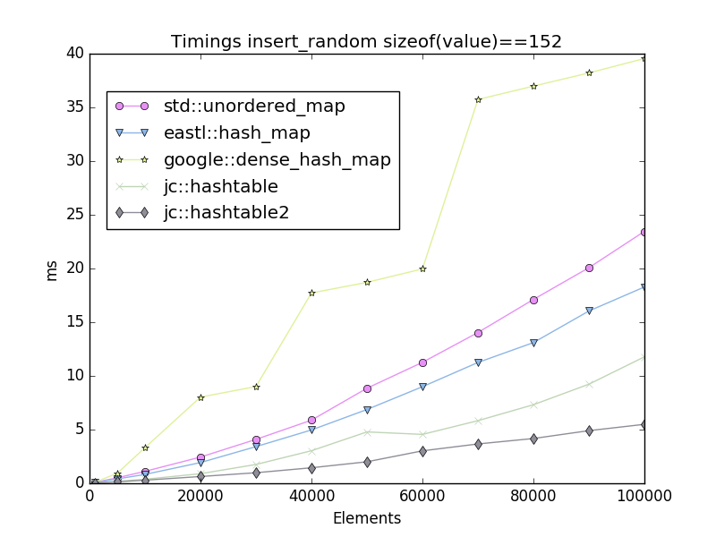
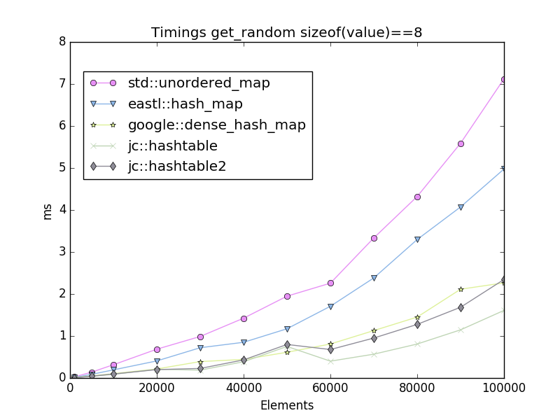
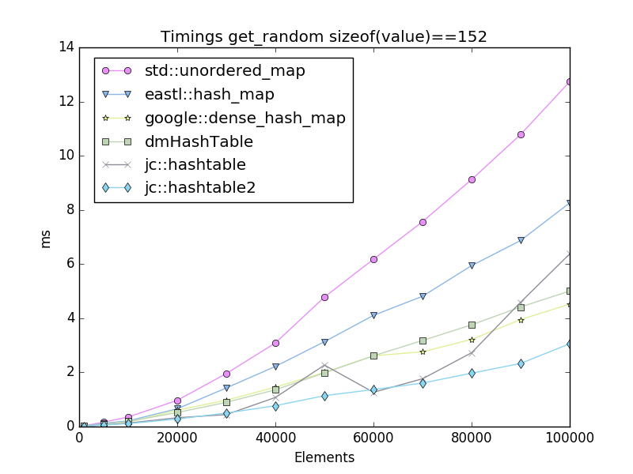
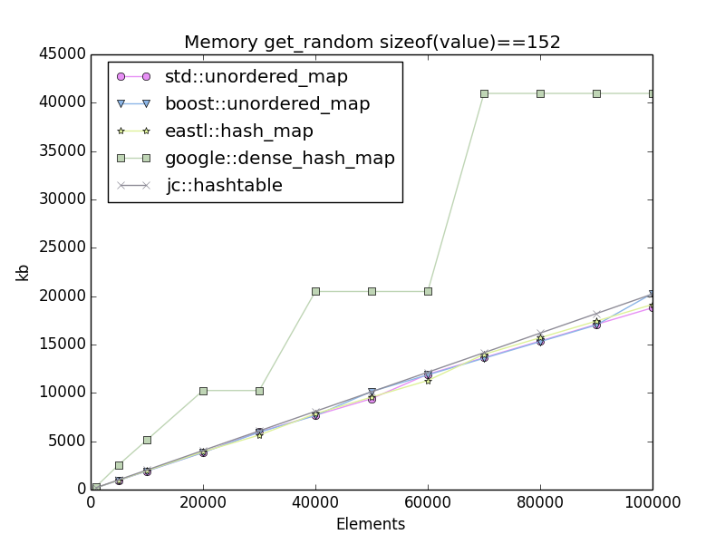

|Branch      | OSX / Linux | Windows     |
|------------|-------------|-------------|
|master      |  |  |
|dev         |  |  |

# Containers

A collection of containers that I use

# Disclaimer

This software is supplied "AS IS" without any warranties and support

# License

[The MIT license](http://choosealicense.com/licenses/mit/)

## jc::HashTable

A fast and small C++ implementation of a hash table

* ~260 lines of code
* Open addressing
* Robin Hood collision resolving
* Backward shift deletion
* On par with Google's dense_hash_map

# Benchmarks

[Benchmarks Hashtable](benchmarks/benchmarks_ht.md)

Performance examples for jc::HashTable. See benchmark page for more stats.

# Usage

## jc::HashTable

    struct SPod
    {
        int     i;
        float   f;
    };
    typedef jc::HashTable<uint32_t, SPod> hashtable_t;
    
    uint32_t numelements    = 1000; // The maximum number of entries to store
    uint32_t load_factor    = 85; // percent
    uint32_t tablesize      = uint32_t(numelements / (load_factor/100.0f)); 
    uint32_t sizeneeded     = hashtable_t::CalcSize(tablesize);
    
    void* mem = malloc(sizeneeded);
    
    hashtable_t ht;
    ht.Create(numelements, mem);
    
    SPod value = { 1, 2.0f };
    ht.Put(17, value);
    
    Spod* pval = ht.Get(17);
    assert( pval->i == 1 );
    assert( pval->f == 2.0f );
    
    hashtable_t it = ht.Begin();
    hashtable_t itend = ht.End();
    for(; it != itend; ++it)
    {
        printf("key: %u  value: %d, %f\n", *it.GetKey(), it.GetValue()->i, it.GetValue()->f);
    }
    
    ht.Erase(17);
    
    free(mem);

    