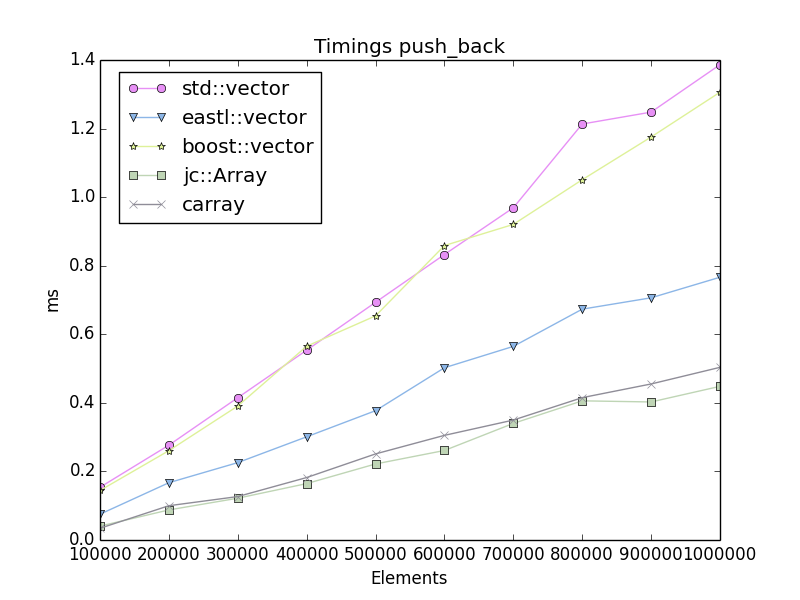

| Build Status | macOS / Linux / Windows   |
|--------------|---------------------------|
|master        |  |
|dev           |  |

# Containers

A collection of header only containers that I use

# Disclaimer

This software is supplied "AS IS" without any warranties and support

# License

[The MIT license](http://choosealicense.com/licenses/mit/)

## [jc::HashTable](src/jc/hashtable.h)

A fast and small C++ implementation of a hash table

* ~260 lines of code
* Open addressing
* Robin Hood collision resolving
* Backward shift deletion
* On par with Google's dense_hash_map

## [jc/algorithm](src/jc/algorithm.h)

The jc::lower_bound and jc::upper_bound are about 1.6x - 2.3x faster than their STL counter parts.

## [jc::radix_sort](src/jc/sort.h)

The radix sort is a stable sort, which requires an output buffer of the same length.
It is ~70 lines of code.
It is 12%-25% faster than [ska::sort](https://github.com/skarupke/ska_sort)

## [jc::Array](src/jc/array.h)

A fast and small C++ container for storing dynamic arrays.

* ~140 lines of code
* ~3x faster than std::vector, and ~2x faster than eastl::vector when using "push_back"
* Otherwise same performance as the others

## [jc/test](src/jc/test.h)

A tiny C/C++ test framework:

* Less than 1kloc.
* Very fast compile times
* Minimal executable size overhead
* Header only
* Usable as a GTEST replacement (for a subset of features)

# [Benchmarks](benchmarks/README.md)

*See [benchmark page](benchmarks/README.md) for more stats.*

Performance examples for jc::HashTable.
 

Performance examples for jc::Array.(See benchmark page for more stats)
 

# Usage

## jc::HashTable

    struct SPod
    {
        int     i;
        float   f;
    };
    typedef jc::HashTable<uint32_t, SPod> hashtable_t;
    
    uint32_t numelements    = 1000; // The maximum number of entries to store
    uint32_t load_factor    = 85; // percent
    uint32_t tablesize      = uint32_t(numelements / (load_factor/100.0f)); 
    uint32_t sizeneeded     = hashtable_t::CalcSize(tablesize);
    
    void* mem = malloc(sizeneeded);
    
    hashtable_t ht;
    ht.Create(numelements, mem);
    
    SPod value = { 1, 2.0f };
    ht.Put(17, value);
    
    Spod* pval = ht.Get(17);
    assert( pval->i == 1 );
    assert( pval->f == 2.0f );
    
    hashtable_t it = ht.Begin();
    hashtable_t itend = ht.End();
    for(; it != itend; ++it)
    {
        printf("key: %u  value: %d, %f\n", *it.GetKey(), it.GetValue()->i, it.GetValue()->f);
    }
    
    ht.Erase(17);
    
    free(mem);

    
## jc::Array

    #include <jc/array.h>

    jc::Array<int> a;
    a.SetCapacity(4);
    for(size_t i = 0; i < a.Capacity(); ++i)
        a.Push(i);
    
    a.EraseSwap(0); // 0,1,2,3 -> 3,1,2    
    
    size_t sum = 0;
    for(size_t i = 0; i < a.Size(); ++i)
        sum += a[i];

    