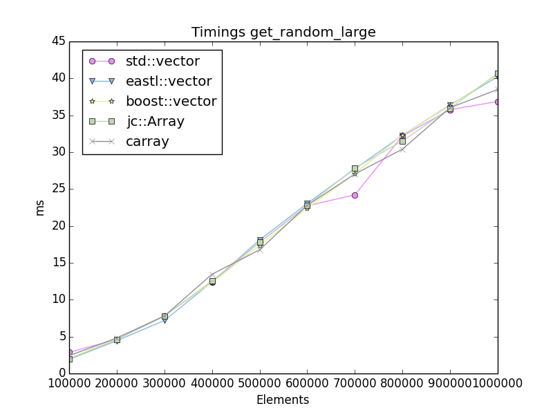
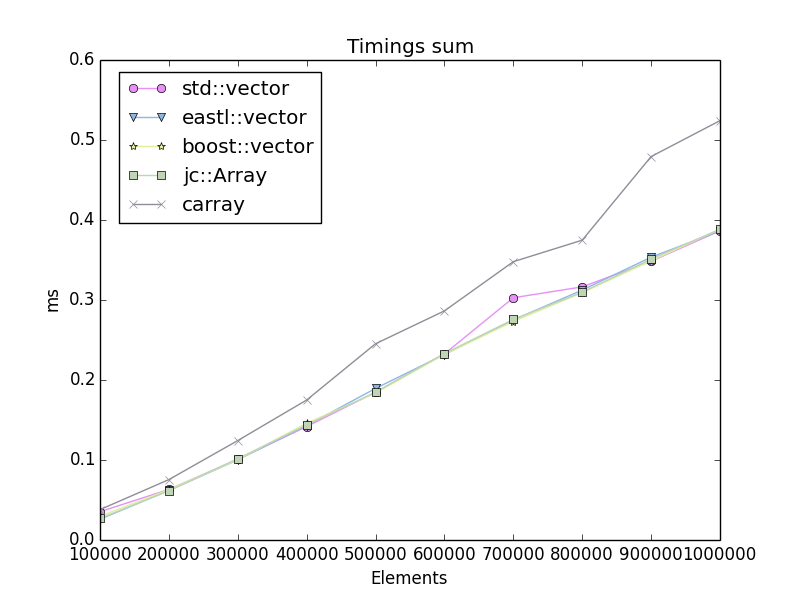

# jc::Array benchmarks

Benchmarks run on a: MacBookPro14,2   Intel(R) Core(TM) i7-7567U CPU @ 3.50GHz

# Images
_
 

_
 

# Tables

### report.txt

## Timings get_random_small

| counts | std::vector | eastl::vector | boost::vector | jc::Array |
|--------:|-------------|---------------|---------------|------------|
| 100000 | 0.8301 ms | 0.8076 ms | 0.8070 ms | 0.8073 ms |
| 200000 | 1.7399 ms | 1.6838 ms | 1.7015 ms | 1.6502 ms |
| 300000 | 2.9307 ms | 2.8138 ms | 2.7659 ms | 2.8229 ms |
| 400000 | 3.8769 ms | 3.9701 ms | 3.9898 ms | 4.3189 ms |
| 500000 | 5.5413 ms | 6.2926 ms | 5.8681 ms | 5.9643 ms |
| 600000 | 9.0944 ms | 9.5409 ms | 9.5429 ms | 8.6863 ms |
| 700000 | 12.0396 ms | 12.0469 ms | 11.8891 ms | 12.1188 ms |
| 800000 | 15.0395 ms | 15.5296 ms | 15.0654 ms | 14.9511 ms |
| 900000 | 17.9646 ms | 16.7328 ms | 18.1123 ms | 17.7658 ms |
| 1000000 | 20.4299 ms | 20.8780 ms | 21.0526 ms | 20.3419 ms |

## Timings get_random_large

| counts | std::vector | eastl::vector | boost::vector | jc::Array |
|--------:|-------------|---------------|---------------|------------|
| 100000 | 3.0351 ms | 1.9380 ms | 2.0532 ms | 2.0162 ms |
| 200000 | 4.6583 ms | 4.5259 ms | 4.7128 ms | 4.7252 ms |
| 300000 | 8.1514 ms | 7.9548 ms | 8.0221 ms | 7.7666 ms |
| 400000 | 12.6710 ms | 14.0151 ms | 12.6651 ms | 12.4697 ms |
| 500000 | 18.3889 ms | 18.5854 ms | 17.8200 ms | 17.2721 ms |
| 600000 | 23.2546 ms | 23.5543 ms | 22.9486 ms | 22.2995 ms |
| 700000 | 27.5151 ms | 28.0592 ms | 27.5168 ms | 27.1755 ms |
| 800000 | 32.0440 ms | 32.6445 ms | 32.1771 ms | 32.2110 ms |
| 900000 | 36.4793 ms | 35.8226 ms | 36.1838 ms | 36.2182 ms |
| 1000000 | 40.9676 ms | 40.9470 ms | 40.3537 ms | 39.9463 ms |

## Timings sum

| counts | std::vector | eastl::vector | boost::vector | jc::Array |
|--------:|-------------|---------------|---------------|-----------|
| 100000 | 0.0327 ms | 0.0248 ms | 0.0278 ms | 0.0276 ms |
| 200000 | 0.0647 ms | 0.0619 ms | 0.0645 ms | 0.0622 ms |
| 300000 | 0.0992 ms | 0.1087 ms | 0.1008 ms | 0.1003 ms |
| 400000 | 0.1428 ms | 0.1435 ms | 0.1418 ms | 0.1426 ms |
| 500000 | 0.1853 ms | 0.1866 ms | 0.1857 ms | 0.1850 ms |
| 600000 | 0.2323 ms | 0.2459 ms | 0.2334 ms | 0.2336 ms |
| 700000 | 0.2758 ms | 0.2727 ms | 0.2783 ms | 0.2805 ms |
| 800000 | 0.3106 ms | 0.3326 ms | 0.3124 ms | 0.3104 ms |
| 900000 | 0.3488 ms | 0.3797 ms | 0.3507 ms | 0.3631 ms |
| 1000000 | 0.3839 ms | 0.3926 ms | 0.3846 ms | 0.3873 ms |

## Timings push_back

| counts | std::vector | eastl::vector | boost::vector | jc::Array |
|--------:|-------------|---------------|---------------|-----------|
| 100000 | 0.1581 ms | 0.0753 ms | 0.1368 ms | 0.0405 ms |
| 200000 | 0.2768 ms | 0.1504 ms | 0.2608 ms | 0.0831 ms |
| 300000 | 0.4151 ms | 0.2326 ms | 0.3910 ms | 0.1214 ms |
| 400000 | 0.5537 ms | 0.3148 ms | 0.5212 ms | 0.1713 ms |
| 500000 | 0.6924 ms | 0.4070 ms | 0.6761 ms | 0.2343 ms |
| 600000 | 0.8321 ms | 0.5474 ms | 0.7888 ms | 0.2853 ms |
| 700000 | 0.9707 ms | 0.5876 ms | 0.9420 ms | 0.3613 ms |
| 800000 | 1.1094 ms | 0.6127 ms | 1.0515 ms | 0.3652 ms |
| 900000 | 1.2480 ms | 0.6900 ms | 1.1768 ms | 0.4018 ms |
| 1000000 | 1.3852 ms | 0.7662 ms | 1.3047 ms | 0.4477 ms |

