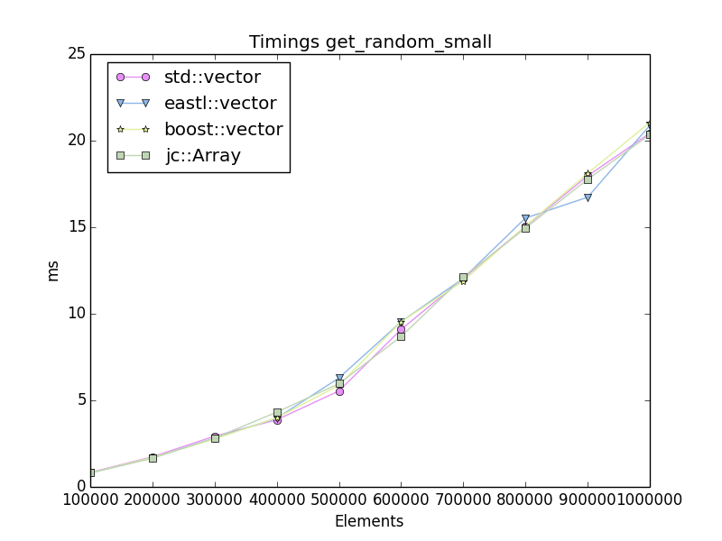
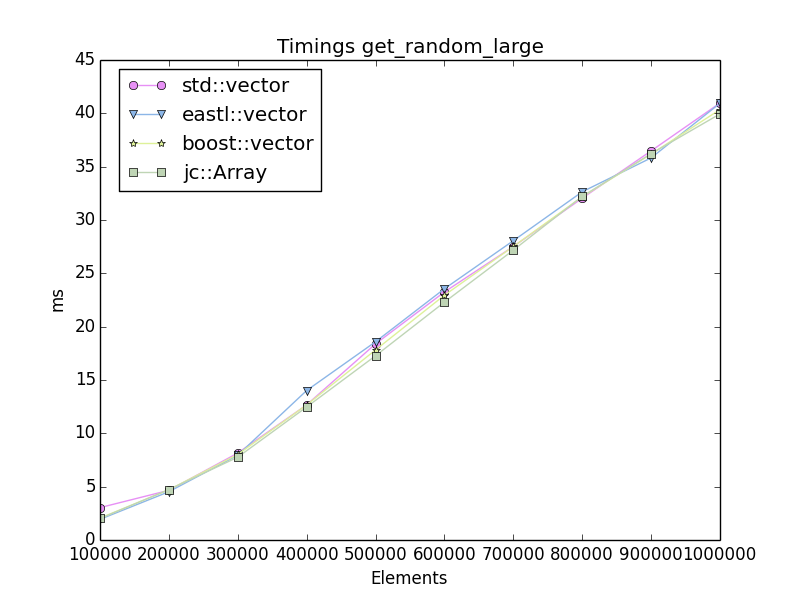
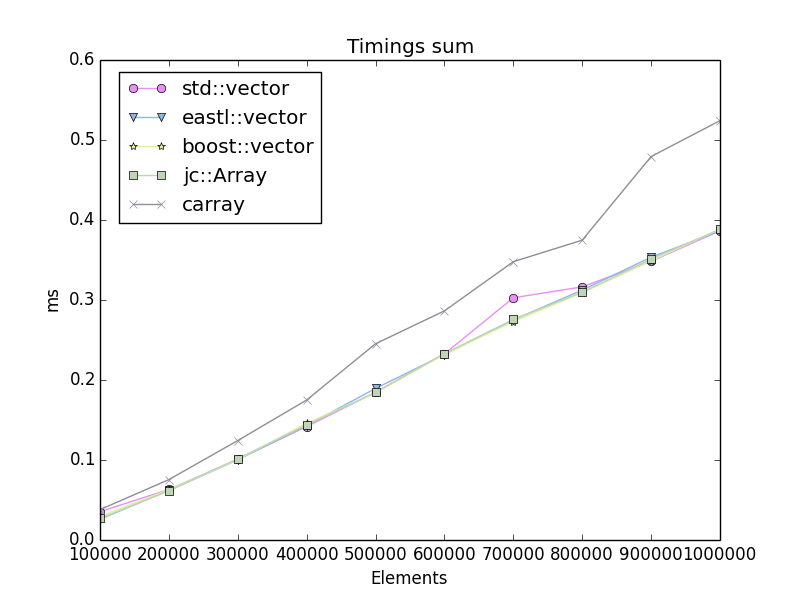
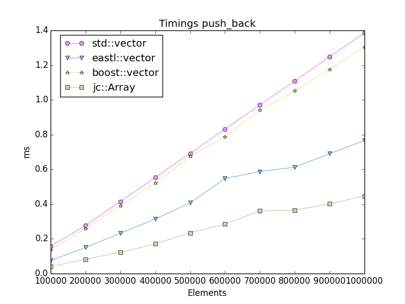

# jc::Array benchmarks

Benchmarks run on a: b'MacBookPro18,3'   b'Apple M1 Pro'

# Images
_
 

_
 

# Tables

### report.txt

## Timings get_random_small

| counts | carray | std::vector | boost::vector | jc::Array |
|--------:|-----------|-------------|---------------|-----------|
| 100000 | 0.7136 ms | 0.7120 ms | 0.7120 ms | 0.7121 ms |

| 200000 | 1.4414 ms | 1.4360 ms | 1.4263 ms | 1.4266 ms |

| 300000 | 2.2113 ms | 2.2018 ms | 2.1843 ms | 2.2096 ms |

| 400000 | 3.0264 ms | 2.9470 ms | 2.9482 ms | 2.9983 ms |

| 500000 | 3.8195 ms | 3.7090 ms | 3.7188 ms | 3.7883 ms |

| 600000 | 4.6223 ms | 4.4828 ms | 4.4828 ms | 4.5829 ms |

| 700000 | 5.4262 ms | 5.2497 ms | 5.2559 ms | 5.3947 ms |

| 800000 | 6.2504 ms | 6.0370 ms | 6.0279 ms | 6.1950 ms |

| 900000 | 6.9080 ms | 6.8053 ms | 6.8157 ms | 6.9795 ms |

| 1000000 | 7.8038 ms | 7.5842 ms | 7.5914 ms | 7.7868 ms |

## Timings get_random_large

| counts | carray | std::vector | boost::vector | jc::Array |
|--------:|------------|-------------|---------------|------------|
| 100000 | 0.7189 ms | 0.7155 ms | 0.7153 ms | 0.7154 ms |

| 200000 | 1.8261 ms | 1.7670 ms | 2.0246 ms | 1.7935 ms |

| 300000 | 3.3612 ms | 3.3522 ms | 3.3595 ms | 3.3588 ms |

| 400000 | 4.8297 ms | 4.8163 ms | 4.8187 ms | 4.8242 ms |

| 500000 | 6.2771 ms | 6.2727 ms | 6.2831 ms | 6.2735 ms |

| 600000 | 7.7423 ms | 7.6815 ms | 7.6870 ms | 7.6786 ms |

| 700000 | 9.1008 ms | 9.0972 ms | 9.1050 ms | 9.0908 ms |

| 800000 | 10.4983 ms | 10.4903 ms | 10.4965 ms | 10.5044 ms |

| 900000 | 13.3733 ms | 11.8640 ms | 11.8804 ms | 11.8810 ms |

| 1000000 | 15.3142 ms | 13.2417 ms | 13.2668 ms | 13.2599 ms |

## Timings sum

| counts | carray | std::vector | boost::vector | jc::Array |
|--------:|-----------|-------------|---------------|-----------|
| 100000 | 0.0108 ms | 0.0104 ms | 0.0101 ms | 0.0100 ms |

| 200000 | 0.0230 ms | 0.0229 ms | 0.0228 ms | 0.0225 ms |

| 300000 | 0.0397 ms | 0.0376 ms | 0.0375 ms | 0.0368 ms |

| 400000 | 0.0558 ms | 0.0528 ms | 0.0528 ms | 0.0527 ms |

| 500000 | 0.0693 ms | 0.0676 ms | 0.0686 ms | 0.0676 ms |

| 600000 | 0.0852 ms | 0.0831 ms | 0.0835 ms | 0.0858 ms |

| 700000 | 0.1000 ms | 0.0983 ms | 0.0987 ms | 0.0993 ms |

| 800000 | 0.1545 ms | 0.1141 ms | 0.1143 ms | 0.1130 ms |

| 900000 | 0.1812 ms | 0.1295 ms | 0.1288 ms | 0.1269 ms |

| 1000000 | 0.2667 ms | 0.1455 ms | 0.1455 ms | 0.1403 ms |

## Timings push_back

| counts | carray | std::vector | boost::vector | jc::Array |
|--------:|-----------|-------------|---------------|-----------|
| 100000 | 0.0635 ms | 0.0506 ms | 0.2146 ms | 0.0378 ms |

| 200000 | 0.1305 ms | 0.1007 ms | 0.4294 ms | 0.0757 ms |

| 300000 | 0.2014 ms | 0.1511 ms | 0.6551 ms | 0.1135 ms |

| 400000 | 0.0991 ms | 0.2017 ms | 0.8755 ms | 0.1506 ms |

| 500000 | 0.2848 ms | 0.2520 ms | 1.0953 ms | 0.1885 ms |

| 600000 | 0.3390 ms | 0.3025 ms | 1.3008 ms | 0.2253 ms |

| 700000 | 0.1089 ms | 0.3529 ms | 1.5326 ms | 0.2647 ms |

| 800000 | 0.4559 ms | 0.4036 ms | 1.7343 ms | 0.3016 ms |

| 900000 | 0.5053 ms | 0.4539 ms | 1.9627 ms | 0.3415 ms |

| 1000000 | 0.5665 ms | 0.5072 ms | 2.1670 ms | 0.3783 ms |

