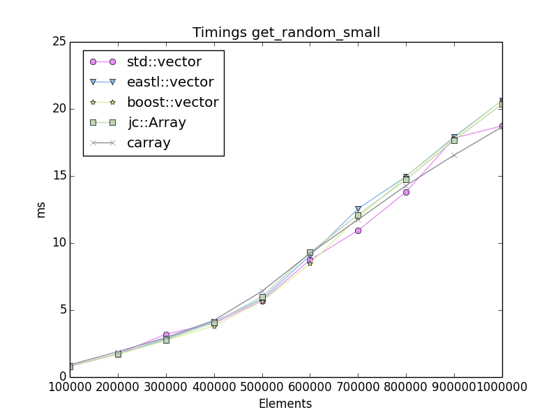

# jc::Array benchmarks

Benchmarks run on a: MacBookPro14,2   Intel(R) Core(TM) i7-7567U CPU @ 3.50GHz

# Images
_
 

_
 

# Tables

### report.txt

## Timings get_random_small

| counts | std::vector | eastl::vector | boost::vector | jc::Array | carray |
|--------:|-------------|---------------|---------------|------------|------------|
| 100000 | 0.8264 ms | 0.8080 ms | 0.8081 ms | 0.8070 ms | 0.9156 ms |
| 200000 | 1.7394 ms | 1.7150 ms | 1.6988 ms | 1.7306 ms | 1.8948 ms |
| 300000 | 3.1953 ms | 2.8719 ms | 2.7273 ms | 2.7776 ms | 2.9445 ms |
| 400000 | 4.0184 ms | 4.1398 ms | 3.8273 ms | 4.0719 ms | 4.2344 ms |
| 500000 | 5.6850 ms | 5.8138 ms | 5.6511 ms | 5.9827 ms | 6.4052 ms |
| 600000 | 8.7354 ms | 9.0637 ms | 8.4654 ms | 9.2994 ms | 9.2293 ms |
| 700000 | 10.9367 ms | 12.5569 ms | 11.9072 ms | 12.1086 ms | 11.7493 ms |
| 800000 | 13.8100 ms | 14.9648 ms | 14.9357 ms | 14.7252 ms | 14.2899 ms |
| 900000 | 17.8260 ms | 17.9126 ms | 17.8071 ms | 17.6653 ms | 16.5598 ms |
| 1000000 | 18.7424 ms | 20.6326 ms | 20.6248 ms | 20.3646 ms | 18.6638 ms |

## Timings get_random_large

| counts | std::vector | eastl::vector | boost::vector | jc::Array | carray |
|--------:|-------------|---------------|---------------|------------|------------|
| 100000 | 2.8695 ms | 1.9055 ms | 2.0528 ms | 1.9727 ms | 2.4154 ms |
| 200000 | 4.6309 ms | 4.4411 ms | 4.7103 ms | 4.5928 ms | 4.8088 ms |
| 300000 | 7.8132 ms | 7.1768 ms | 7.8538 ms | 7.7742 ms | 7.7942 ms |
| 400000 | 12.3929 ms | 12.4093 ms | 12.3329 ms | 12.5360 ms | 13.4506 ms |
| 500000 | 17.7810 ms | 18.1099 ms | 17.3735 ms | 17.8010 ms | 16.7615 ms |
| 600000 | 22.7329 ms | 23.0500 ms | 22.4068 ms | 22.7911 ms | 22.7921 ms |
| 700000 | 24.2275 ms | 27.7321 ms | 27.0947 ms | 27.8435 ms | 27.0367 ms |
| 800000 | 32.2001 ms | 32.2912 ms | 32.3264 ms | 31.5190 ms | 30.4063 ms |
| 900000 | 35.7571 ms | 36.4017 ms | 36.3096 ms | 35.9511 ms | 36.0292 ms |
| 1000000 | 36.8750 ms | 40.2151 ms | 40.4876 ms | 40.6841 ms | 38.4951 ms |

## Timings sum

| counts | std::vector | eastl::vector | boost::vector | jc::Array | carray |
|--------:|-------------|---------------|---------------|-----------|-----------|
| 100000 | 0.0354 ms | 0.0260 ms | 0.0295 ms | 0.0270 ms | 0.0380 ms |
| 200000 | 0.0632 ms | 0.0619 ms | 0.0630 ms | 0.0615 ms | 0.0755 ms |
| 300000 | 0.1009 ms | 0.1003 ms | 0.1005 ms | 0.1016 ms | 0.1243 ms |
| 400000 | 0.1418 ms | 0.1431 ms | 0.1459 ms | 0.1439 ms | 0.1750 ms |
| 500000 | 0.1847 ms | 0.1895 ms | 0.1838 ms | 0.1847 ms | 0.2453 ms |
| 600000 | 0.2327 ms | 0.2318 ms | 0.2320 ms | 0.2331 ms | 0.2864 ms |
| 700000 | 0.3028 ms | 0.2751 ms | 0.2731 ms | 0.2757 ms | 0.3479 ms |
| 800000 | 0.3164 ms | 0.3124 ms | 0.3092 ms | 0.3097 ms | 0.3748 ms |
| 900000 | 0.3484 ms | 0.3535 ms | 0.3490 ms | 0.3512 ms | 0.4793 ms |
| 1000000 | 0.3866 ms | 0.3863 ms | 0.3886 ms | 0.3884 ms | 0.5242 ms |

## Timings push_back

| counts | std::vector | eastl::vector | boost::vector | jc::Array | carray |
|--------:|-------------|---------------|---------------|-----------|-----------|
| 100000 | 0.1538 ms | 0.0752 ms | 0.1444 ms | 0.0405 ms | 0.0342 ms |
| 200000 | 0.2766 ms | 0.1671 ms | 0.2606 ms | 0.0877 ms | 0.1000 ms |
| 300000 | 0.4150 ms | 0.2257 ms | 0.3908 ms | 0.1219 ms | 0.1267 ms |
| 400000 | 0.5536 ms | 0.3010 ms | 0.5652 ms | 0.1645 ms | 0.1822 ms |
| 500000 | 0.6933 ms | 0.3772 ms | 0.6537 ms | 0.2218 ms | 0.2511 ms |
| 600000 | 0.8327 ms | 0.5024 ms | 0.8588 ms | 0.2611 ms | 0.3052 ms |
| 700000 | 0.9690 ms | 0.5647 ms | 0.9205 ms | 0.3401 ms | 0.3498 ms |
| 800000 | 1.2133 ms | 0.6733 ms | 1.0508 ms | 0.4059 ms | 0.4152 ms |
| 900000 | 1.2480 ms | 0.7064 ms | 1.1754 ms | 0.4026 ms | 0.4551 ms |
| 1000000 | 1.3864 ms | 0.7664 ms | 1.3061 ms | 0.4482 ms | 0.5036 ms |

