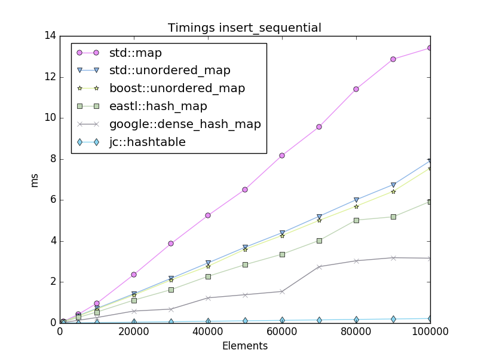
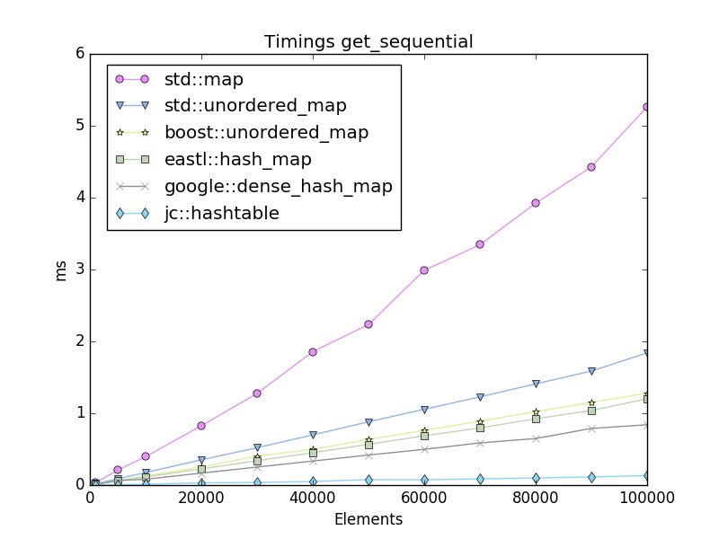
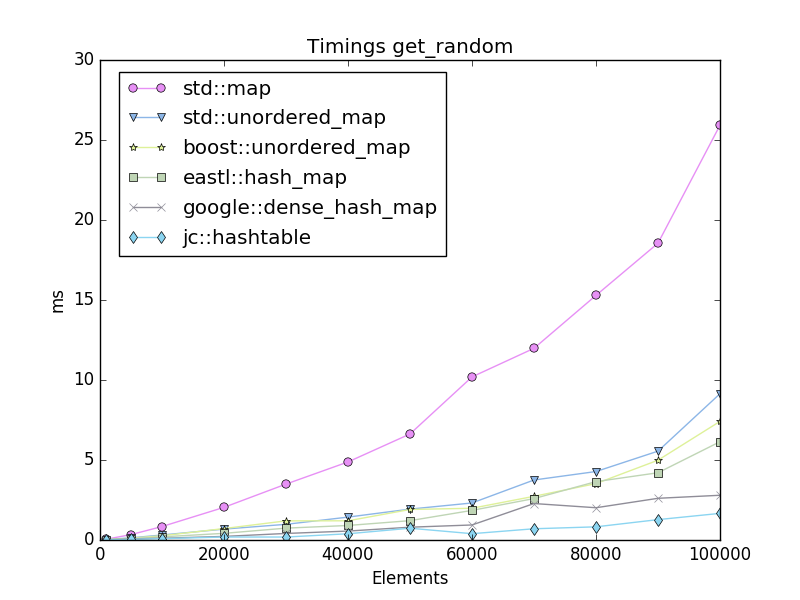
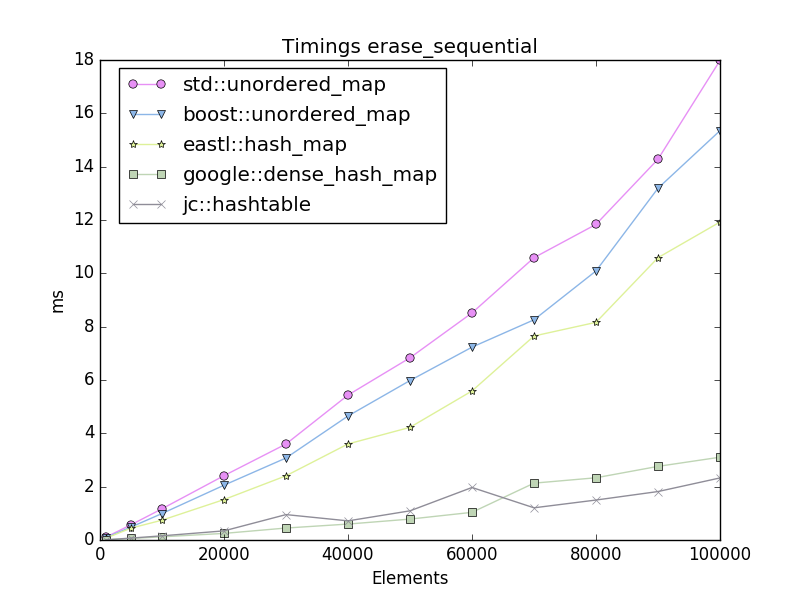
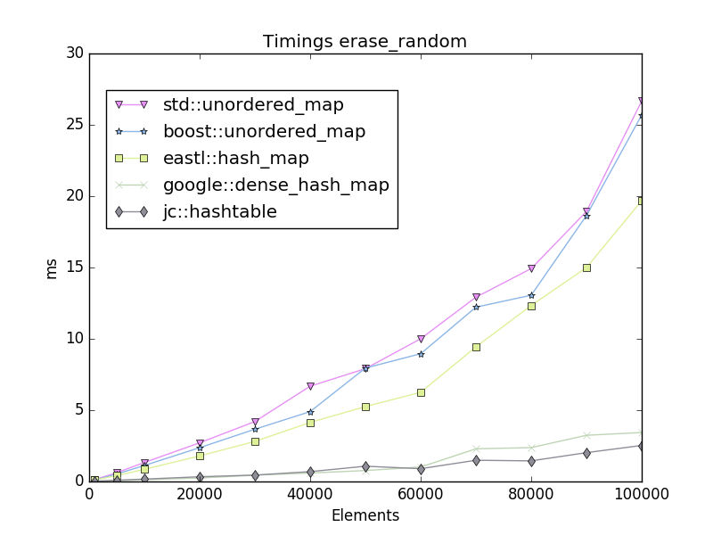
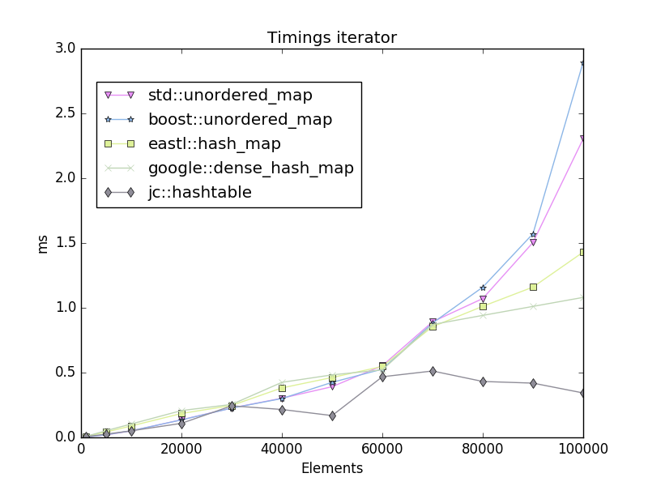
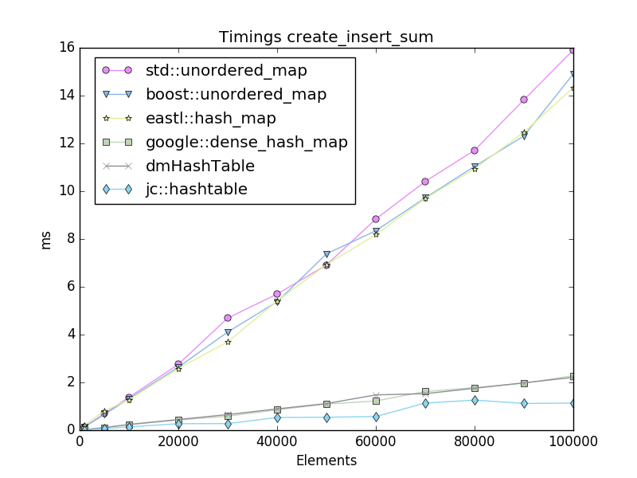
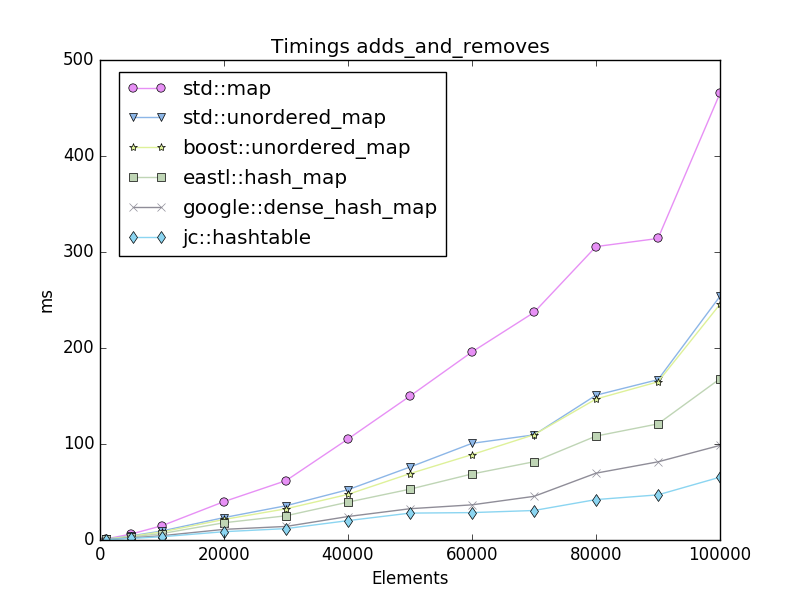

# Hashtable benchmarks

Benchmarks run on a: MacBookPro10,2   Intel(R) Core(TM) i7-3520M CPU @ 2.90GHz

# Images

# Tables

## Timings insert_sequential

| counts | std::unordered_map | boost::unordered_map | eastl::hash_map | google::dense_hash_map | jc::hashtable |
|-------:|--------------------|----------------------|-----------------|------------------------|---------------|
| 1000 | 0.0911 ms | 0.0914 ms | 0.0880 ms | 0.0269 ms | 0.0024 ms |
| 5000 | 0.4313 ms | 0.3969 ms | 0.3359 ms | 0.1608 ms | 0.0119 ms |
| 10000 | 0.8537 ms | 0.7948 ms | 0.6755 ms | 0.2752 ms | 0.0224 ms |
| 20000 | 1.7101 ms | 1.6056 ms | 1.3563 ms | 0.5952 ms | 0.0489 ms |
| 30000 | 2.7124 ms | 2.5198 ms | 1.8987 ms | 0.6962 ms | 0.0673 ms |
| 40000 | 3.4682 ms | 3.2516 ms | 2.8356 ms | 1.1602 ms | 0.0977 ms |
| 50000 | 4.2686 ms | 4.4724 ms | 3.3971 ms | 1.3210 ms | 0.1121 ms |
| 60000 | 5.5923 ms | 5.1193 ms | 3.9619 ms | 1.4392 ms | 0.1345 ms |
| 70000 | 6.3390 ms | 5.9599 ms | 5.2843 ms | 2.4889 ms | 0.1571 ms |
| 80000 | 7.0612 ms | 6.7637 ms | 5.9741 ms | 2.6404 ms | 0.1794 ms |
| 90000 | 7.9096 ms | 7.4041 ms | 6.4550 ms | 2.8086 ms | 0.2018 ms |
| 100000 | 8.7586 ms | 9.2398 ms | 7.0148 ms | 2.9692 ms | 0.2245 ms |

## Timings insert_random

| counts | std::unordered_map | boost::unordered_map | eastl::hash_map | google::dense_hash_map | jc::hashtable |
|-------:|--------------------|----------------------|-----------------|------------------------|---------------|
| 1000 | 0.1226 ms | 0.1156 ms | 0.0944 ms | 0.0425 ms | 0.0101 ms |
| 5000 | 0.6624 ms | 0.5227 ms | 0.4602 ms | 0.2523 ms | 0.0749 ms |
| 10000 | 1.2309 ms | 1.0573 ms | 0.9358 ms | 0.5095 ms | 0.1505 ms |
| 20000 | 2.5461 ms | 2.2666 ms | 1.9491 ms | 1.0327 ms | 0.3628 ms |
| 30000 | 4.1463 ms | 3.6921 ms | 2.7542 ms | 1.3309 ms | 1.2404 ms |
| 40000 | 5.3609 ms | 4.8067 ms | 4.1350 ms | 2.1969 ms | 0.7045 ms |
| 50000 | 6.5768 ms | 6.7427 ms | 4.9438 ms | 2.5015 ms | 1.1614 ms |
| 60000 | 9.1941 ms | 8.2169 ms | 5.7917 ms | 2.8805 ms | 2.5893 ms |
| 70000 | 10.1365 ms | 8.8176 ms | 8.4188 ms | 5.2097 ms | 1.1229 ms |
| 80000 | 12.1436 ms | 10.3555 ms | 9.4640 ms | 5.4117 ms | 1.4487 ms |
| 90000 | 13.7588 ms | 12.3867 ms | 10.4999 ms | 5.9058 ms | 1.8458 ms |
| 100000 | 14.5588 ms | 17.1879 ms | 11.4229 ms | 6.6065 ms | 2.3743 ms |

## Timings get_sequential

| counts | std::unordered_map | boost::unordered_map | eastl::hash_map | google::dense_hash_map | jc::hashtable |
|-------:|--------------------|----------------------|-----------------|------------------------|---------------|
| 1000 | 0.0174 ms | 0.0134 ms | 0.0122 ms | 0.0084 ms | 0.0013 ms |
| 5000 | 0.0878 ms | 0.0615 ms | 0.0563 ms | 0.0392 ms | 0.0060 ms |
| 10000 | 0.1747 ms | 0.1232 ms | 0.1127 ms | 0.1003 ms | 0.0130 ms |
| 20000 | 0.3473 ms | 0.2462 ms | 0.2249 ms | 0.1615 ms | 0.0309 ms |
| 30000 | 0.5270 ms | 0.3680 ms | 0.3400 ms | 0.2644 ms | 0.0372 ms |
| 40000 | 0.7034 ms | 0.4933 ms | 0.4506 ms | 0.3236 ms | 0.0612 ms |
| 50000 | 0.8788 ms | 0.6157 ms | 0.5655 ms | 0.4042 ms | 0.0615 ms |
| 60000 | 1.0556 ms | 0.7394 ms | 0.6822 ms | 0.4695 ms | 0.0803 ms |
| 70000 | 1.2259 ms | 0.8674 ms | 0.7901 ms | 0.5680 ms | 0.0863 ms |
| 80000 | 1.4111 ms | 0.9915 ms | 0.9080 ms | 0.6272 ms | 0.0987 ms |
| 90000 | 1.5936 ms | 1.1236 ms | 1.0259 ms | 0.7032 ms | 0.1113 ms |
| 100000 | 1.7681 ms | 1.2458 ms | 1.1467 ms | 0.8092 ms | 0.1376 ms |

## Timings get_random

| counts | std::unordered_map | boost::unordered_map | eastl::hash_map | google::dense_hash_map | jc::hashtable |
|-------:|--------------------|----------------------|-----------------|------------------------|---------------|
| 1000 | 0.0236 ms | 0.0195 ms | 0.0160 ms | 0.0124 ms | 0.0058 ms |
| 5000 | 0.1376 ms | 0.1147 ms | 0.0881 ms | 0.0520 ms | 0.0416 ms |
| 10000 | 0.3123 ms | 0.2636 ms | 0.1992 ms | 0.1330 ms | 0.0850 ms |
| 20000 | 0.6780 ms | 0.5707 ms | 0.4108 ms | 0.2198 ms | 0.1865 ms |
| 30000 | 0.9832 ms | 0.8007 ms | 0.7320 ms | 0.4012 ms | 0.5124 ms |
| 40000 | 1.4257 ms | 1.1956 ms | 0.8668 ms | 0.5237 ms | 0.3870 ms |
| 50000 | 1.9464 ms | 1.4823 ms | 1.2629 ms | 0.7642 ms | 0.7591 ms |
| 60000 | 2.3951 ms | 2.0492 ms | 1.9207 ms | 0.9234 ms | 1.1135 ms |
| 70000 | 3.3078 ms | 2.7856 ms | 2.6562 ms | 1.7146 ms | 0.5577 ms |
| 80000 | 4.1680 ms | 3.6216 ms | 3.0702 ms | 1.9598 ms | 0.7960 ms |
| 90000 | 5.5843 ms | 5.3055 ms | 4.2287 ms | 2.2099 ms | 1.1508 ms |
| 100000 | 7.4481 ms | 5.7785 ms | 5.2061 ms | 2.6329 ms | 1.5942 ms |

## Timings erase_sequential

| counts | std::unordered_map | boost::unordered_map | eastl::hash_map | google::dense_hash_map | jc::hashtable |
|-------:|--------------------|----------------------|-----------------|------------------------|---------------|
| 1000 | 0.1122 ms | 0.0926 ms | 0.0712 ms | 0.0130 ms | 0.0077 ms |
| 5000 | 0.5697 ms | 0.4856 ms | 0.4452 ms | 0.0569 ms | 0.0716 ms |
| 10000 | 1.1702 ms | 0.9924 ms | 0.7436 ms | 0.1199 ms | 0.1565 ms |
| 20000 | 2.4125 ms | 2.0546 ms | 1.5162 ms | 0.2473 ms | 0.3423 ms |
| 30000 | 3.5992 ms | 3.0751 ms | 2.4073 ms | 0.4487 ms | 0.9524 ms |
| 40000 | 5.4343 ms | 4.6499 ms | 3.6018 ms | 0.5973 ms | 0.7173 ms |
| 50000 | 6.8324 ms | 5.9798 ms | 4.2246 ms | 0.7840 ms | 1.0936 ms |
| 60000 | 8.5161 ms | 7.2317 ms | 5.5892 ms | 1.0377 ms | 1.9694 ms |
| 70000 | 10.5874 ms | 8.2577 ms | 7.6498 ms | 2.1319 ms | 1.2071 ms |
| 80000 | 11.8359 ms | 10.0899 ms | 8.1629 ms | 2.3336 ms | 1.4986 ms |
| 90000 | 14.2806 ms | 13.1914 ms | 10.5865 ms | 2.7609 ms | 1.8171 ms |
| 100000 | 17.9818 ms | 15.3503 ms | 11.9242 ms | 3.1052 ms | 2.3274 ms |

## Timings erase_random

| counts | std::unordered_map | boost::unordered_map | eastl::hash_map | google::dense_hash_map | jc::hashtable |
|-------:|--------------------|----------------------|-----------------|------------------------|---------------|
| 1000 | 0.1220 ms | 0.1033 ms | 0.0827 ms | 0.0134 ms | 0.0125 ms |
| 5000 | 0.6152 ms | 0.5732 ms | 0.4123 ms | 0.0582 ms | 0.0771 ms |
| 10000 | 1.3161 ms | 1.1204 ms | 0.8656 ms | 0.1205 ms | 0.1604 ms |
| 20000 | 2.7473 ms | 2.3679 ms | 1.7900 ms | 0.2476 ms | 0.3437 ms |
| 30000 | 4.2174 ms | 3.5594 ms | 2.8049 ms | 0.4474 ms | 0.9434 ms |
| 40000 | 5.9897 ms | 4.9489 ms | 3.7988 ms | 0.5746 ms | 0.7137 ms |
| 50000 | 7.5084 ms | 6.5011 ms | 5.6157 ms | 0.7775 ms | 1.0878 ms |
| 60000 | 10.0182 ms | 8.9756 ms | 7.1233 ms | 1.0069 ms | 1.9498 ms |
| 70000 | 13.0065 ms | 10.2430 ms | 8.8377 ms | 2.0786 ms | 1.1771 ms |
| 80000 | 16.1498 ms | 13.2578 ms | 11.2337 ms | 2.2580 ms | 1.4762 ms |
| 90000 | 19.8489 ms | 17.6300 ms | 13.8976 ms | 2.5950 ms | 1.8152 ms |
| 100000 | 21.8800 ms | 23.1004 ms | 16.9499 ms | 2.8911 ms | 2.2601 ms |

## Timings iterator

| counts | std::unordered_map | boost::unordered_map | eastl::hash_map | google::dense_hash_map | jc::hashtable |
|-------:|--------------------|----------------------|-----------------|------------------------|---------------|
| 1000 | 0.0035 ms | 0.0022 ms | 0.0078 ms | 0.0074 ms | 0.0024 ms |
| 5000 | 0.0201 ms | 0.0219 ms | 0.0429 ms | 0.0531 ms | 0.0215 ms |
| 10000 | 0.0506 ms | 0.0570 ms | 0.0901 ms | 0.1059 ms | 0.0508 ms |
| 20000 | 0.1322 ms | 0.1316 ms | 0.1901 ms | 0.2117 ms | 0.1058 ms |
| 30000 | 0.2266 ms | 0.2246 ms | 0.2540 ms | 0.2592 ms | 0.0457 ms |
| 40000 | 0.3033 ms | 0.2989 ms | 0.3876 ms | 0.4328 ms | 0.2125 ms |
| 50000 | 0.3889 ms | 0.4170 ms | 0.4804 ms | 0.4921 ms | 0.1596 ms |
| 60000 | 0.5358 ms | 0.5290 ms | 0.6169 ms | 0.5276 ms | 0.0940 ms |
| 70000 | 0.7319 ms | 0.7092 ms | 0.8605 ms | 0.8764 ms | 0.4561 ms |
| 80000 | 1.0046 ms | 1.0206 ms | 0.9907 ms | 0.9436 ms | 0.4289 ms |
| 90000 | 1.4750 ms | 1.4875 ms | 1.1981 ms | 1.0073 ms | 0.3869 ms |
| 100000 | 1.8040 ms | 2.3138 ms | 1.4043 ms | 1.0595 ms | 0.3429 ms |

## Timings create_insert_sum

| counts | std::unordered_map | boost::unordered_map | eastl::hash_map | google::dense_hash_map | jc::hashtable |
|-------:|--------------------|----------------------|-----------------|------------------------|---------------|
| 1000 | 0.1780 ms | 0.1351 ms | 0.1331 ms | 0.0198 ms | 0.0143 ms |
| 5000 | 0.6929 ms | 0.6569 ms | 0.7850 ms | 0.1077 ms | 0.0697 ms |
| 10000 | 1.3739 ms | 1.3106 ms | 1.2829 ms | 0.2143 ms | 0.1259 ms |
| 20000 | 2.8851 ms | 2.6351 ms | 2.5324 ms | 0.5309 ms | 0.2607 ms |
| 30000 | 4.2589 ms | 4.1533 ms | 3.7252 ms | 0.7280 ms | 0.3440 ms |
| 40000 | 5.6199 ms | 5.5101 ms | 5.3512 ms | 1.0612 ms | 0.6157 ms |
| 50000 | 6.9681 ms | 7.0093 ms | 6.9447 ms | 1.0156 ms | 0.5423 ms |
| 60000 | 8.7625 ms | 8.3725 ms | 8.2368 ms | 1.4560 ms | 0.6983 ms |
| 70000 | 10.2582 ms | 9.8201 ms | 10.1586 ms | 1.6024 ms | 1.0374 ms |
| 80000 | 11.6925 ms | 10.9191 ms | 10.9802 ms | 1.7938 ms | 1.0596 ms |
| 90000 | 12.9285 ms | 12.4082 ms | 13.0875 ms | 1.9500 ms | 1.0929 ms |
| 100000 | 15.0190 ms | 15.0586 ms | 16.1472 ms | 2.0991 ms | 1.1236 ms |

## Timings adds_and_removes

| counts | std::unordered_map | boost::unordered_map | eastl::hash_map | google::dense_hash_map | jc::hashtable |
|-------:|--------------------|----------------------|-----------------|------------------------|---------------|
| 1000 | 1.1109 ms | 0.8341 ms | 0.8623 ms | 0.4252 ms | 0.3391 ms |
| 5000 | 4.3537 ms | 3.7974 ms | 3.0792 ms | 2.1627 ms | 1.6298 ms |
| 10000 | 9.4555 ms | 8.4022 ms | 6.7460 ms | 4.5051 ms | 3.4718 ms |
| 20000 | 23.3557 ms | 21.0842 ms | 16.3146 ms | 10.9390 ms | 8.9433 ms |
| 30000 | 36.3281 ms | 30.4519 ms | 26.0673 ms | 14.1808 ms | 16.3180 ms |
| 40000 | 52.5394 ms | 48.2025 ms | 36.9924 ms | 23.9023 ms | 19.4952 ms |
| 50000 | 71.7170 ms | 54.7715 ms | 47.6627 ms | 30.8231 ms | 27.4913 ms |
| 60000 | 78.1762 ms | 75.0088 ms | 60.7514 ms | 31.6031 ms | 36.5947 ms |
| 70000 | 106.6616 ms | 93.6189 ms | 75.8708 ms | 42.8003 ms | 32.5700 ms |
| 80000 | 159.6786 ms | 133.7742 ms | 114.7344 ms | 71.6712 ms | 42.7955 ms |
| 90000 | 161.1460 ms | 141.6574 ms | 113.6505 ms | 81.9605 ms | 45.4730 ms |
| 100000 | 229.5011 ms | 218.5141 ms | 159.0008 ms | 93.2573 ms | 59.1703 ms |

